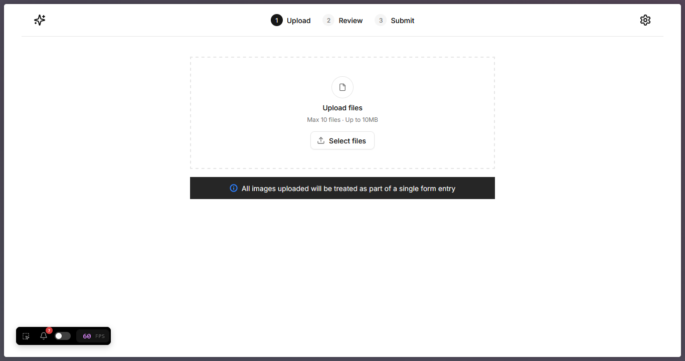

# FORM-READER-APP

This application automates data extraction from scanned or uploaded forms. It parses the form inputs, structures the retrieved data, and makes it readily available for further processing. By streamlining manual entry, it significantly improves speed, accuracy, and efficiency in data handling.

